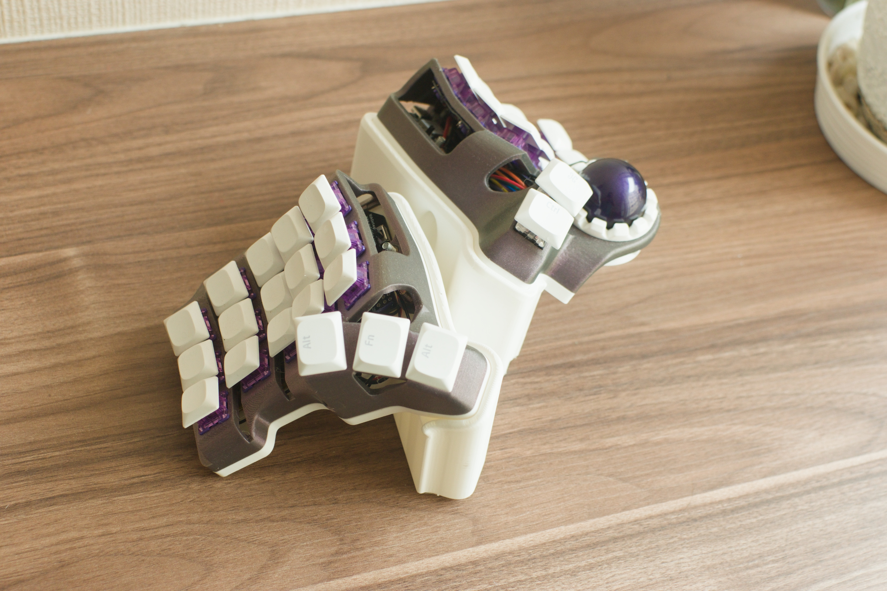
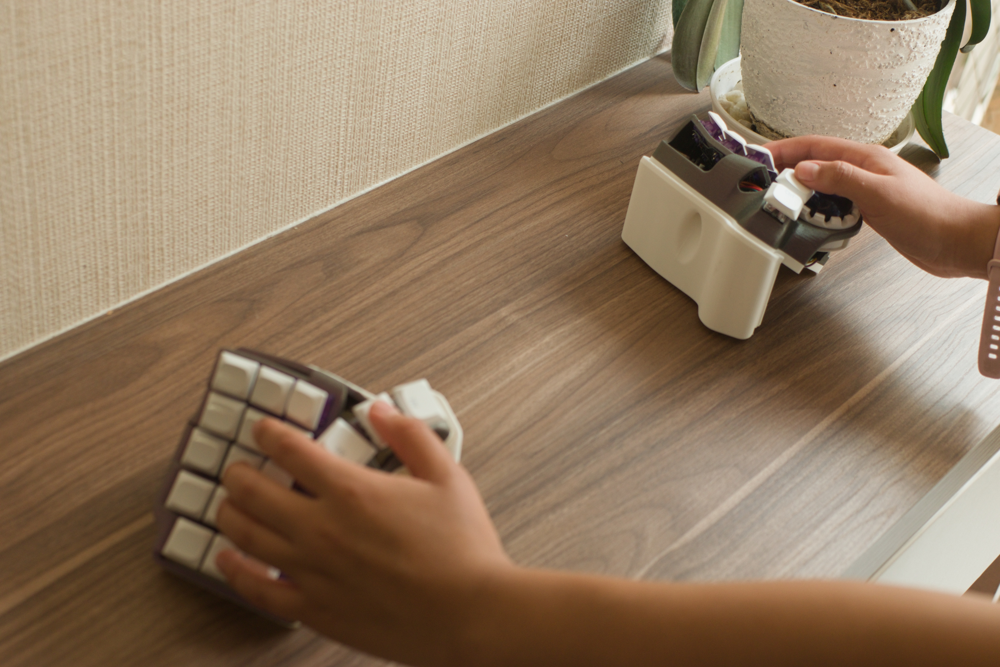

# SUMMARY 
A support to add 30° to some dactyl keyboards

## Models tested
- Skeletyl
- TBK Mini
- Charybidis Nano
- Charybdis Mini

## Addition hardware
- The bolt at the center of the inner sides now must be 2cm long. M4 Flat head, 2cm long.
- Not necessary, but you can add a 1/2" nut and bolt to make it more sturdy and avoid wobbling.
- Add bumper pads to avoid sliding and scratching the surface of the desk.

## Installation
- Remove the M4 bolt at the center of the inner sides of each halve. 
- Place the support
- Use the M4 bolt to fix the support
- Repeat for the other halve

